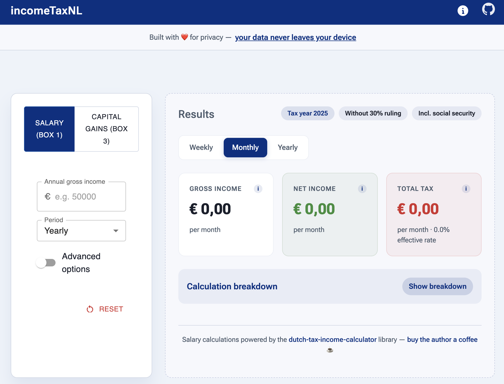
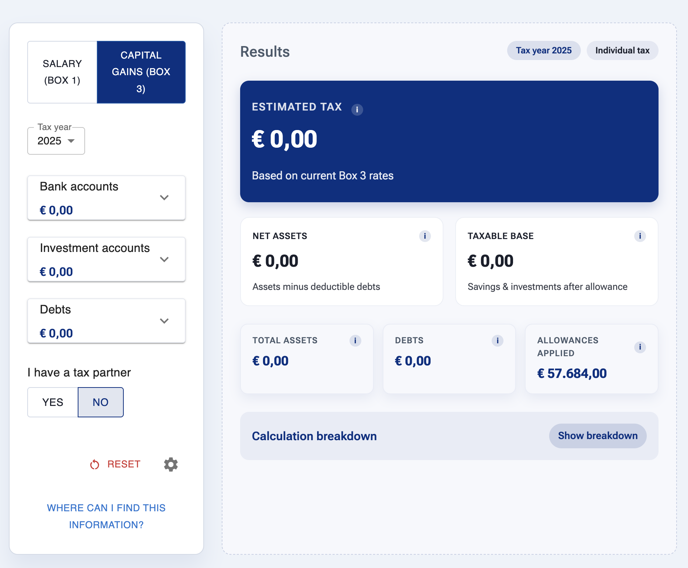

# incomeTaxNL

**Your financial data is your business.** incomeTaxNL is a free and open source tool to estimate Dutch Box 1 and Box 3 taxes. Calculations run in your browser, and entered values are saved locally. The site uses Vercel Analytics for page visits. A URL containing financial values or account names exposes them to recipients and may appear in browser history or hosting logs.

Check any URL before sharing it. Calculations are estimates for guidance, not a personal tax assessment.

### Box 1 (Salary Calculations)

### Box 3 (Capital Gains Calculations)

## Features
- Local calculations and browser-saved inputs
- Pick up where you left off - localStorage function stores your input data in your browser. Close your tab confidently!
- Instantly calculate Dutch salary (Box 1) and capital gains tax (Box 3)
- Simple, clean input forms for salary, savings, investments, and debts
- Tax partner support for accurate thresholds and allowances
- Clear results panel with breakdowns and explanations

## Quick Start
- Requirements: Node.js 18+ and npm
- Dev run:
	1. `cd frontend`
	2. `npm install`
	3. `npm run dev`
	4. Open the local URL printed by Vite (e.g., `http://localhost:5173`)

## Usage
- Financial inputs: Add bank accounts, investment accounts, and debts using the “Manage entries” modal.
- Edit entries: Use the pencil icon; press Enter to add/update; delete with the bin icon.
- Tax partner: Toggle “I have a tax partner” to update thresholds.
- Results: The right panel shows taxable base and estimated Box 3 tax, with a detailed breakdown.

## Configuration
- Open the settings (gear icon) in the header.
- Update Box 3 defaults:
	- Year
	- Thresholds: `taxFreeAssetsPerIndividual`, `debtsThresholdPerIndividual`
	- `taxRate` (%)
	- Assumed return rates (%) for `bankBalance`, `investmentAssets`, `debts`
- Reset to defaults via the restore icon.
- Source of defaults: `frontend/src/features/tax-calculator/constants/box3Defaults.js`

## Project Structure
- Frontend app in `frontend/` (React + Vite)
- Key paths:
	- Inputs: `frontend/src/features/tax-calculator/components/TaxInputForm.jsx`
	- Results: `frontend/src/features/tax-calculator/components/TaxResultPanel.jsx`
	- Config menu: `frontend/src/features/tax-calculator/components/ConfigurationMenu.jsx`
	- Calculator hook: `frontend/src/features/tax-calculator/hooks/useBox3Calculator.js`
	- Box 3 logic: `frontend/src/features/tax-calculator/utils/box3.js`
	- Defaults: `frontend/src/features/tax-calculator/constants/box3Defaults.js`

## Accessibility
- Buttons have descriptive `aria-label`s; keyboard support for Enter to add/update.
- Dialogs announce counts and totals; focus is managed to reduce tab friction.

## Privacy & Disclaimer
- Calculations run locally; Vercel Analytics records page visits. Check URLs before sharing financial values.
- This tool is for guidance and education only. For personal tax decisions, consult the Belastingdienst or a qualified advisor.
